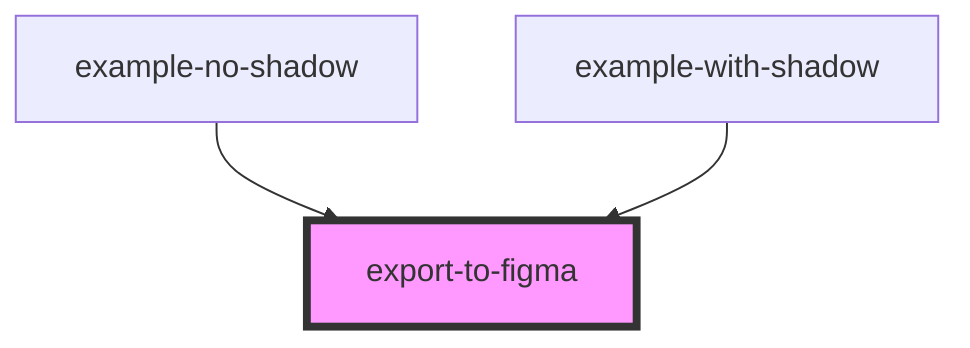

# export-to-figma

<!-- Auto Generated Below -->

## Properties

| Property  | Attribute | Description | Type          | Default     |
| --------- | --------- | ----------- | ------------- | ----------- |
| `element` | --        |             | `HTMLElement` | `undefined` |
| `nokey`   | `nokey`   |             | `boolean`     | `false`     |

## Dependencies

### Used by

 - [example-no-shadow](../no-shadow)
 - [example-with-shadow](../with-shadow)

### Graph

----------------------------------------------

*Built with [StencilJS](https://stenciljs.com/)*
